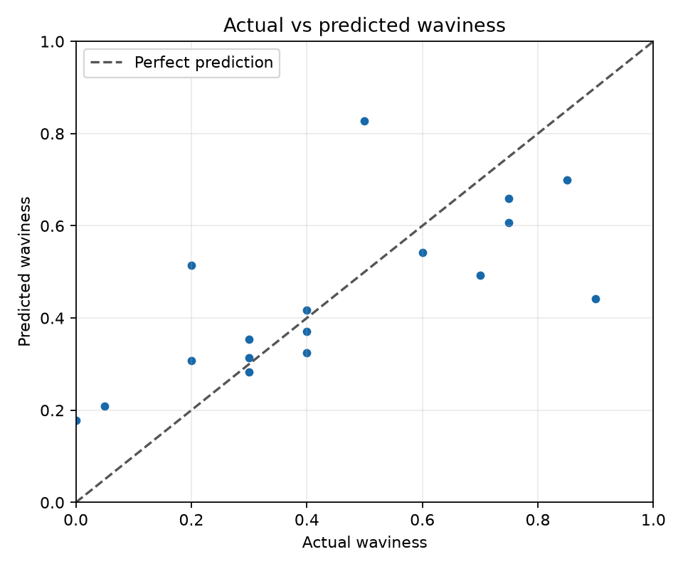
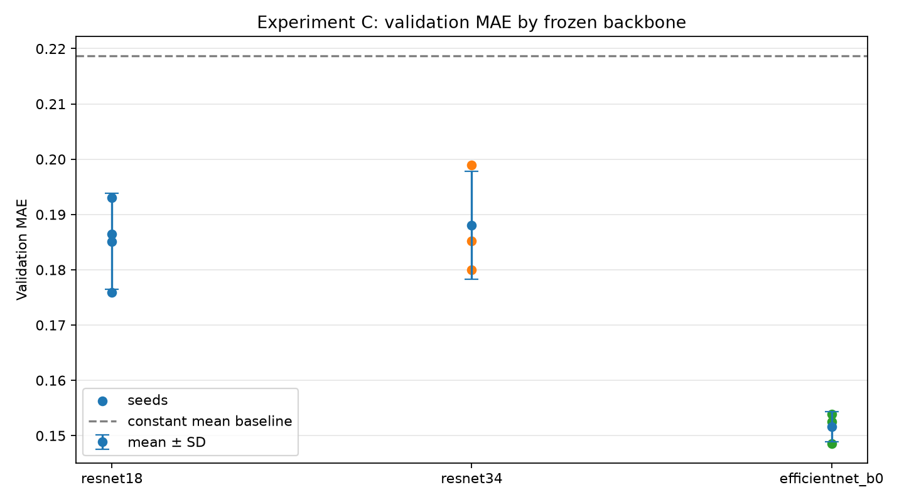

# Wave Waviness Regression

This project explores whether a photo of the sea can help answer a familiar local question: **how wavy is the water today, and is it a good day to swim?** Swimming is part of everyday life where I live, and I used to check the sea from my window each morning. I started collecting photos to see whether a computer vision model could make that daily check more consistent.

The repository contains an image-processing and model-training pipeline for a local swimming application. The model estimates **water waviness from an image**; it does not yet make a complete safety judgment.

## How the pipeline prepares an image

Photos are taken from roughly 200–300 metres from the sea, often from a few recurring locations and angles. The preprocessing pipeline focuses on the sea, removing visual distractions such as sky, buildings, beach, and sand. It then selects a region toward the bottom of the detected sea area, where waves near the coast are most relevant to the swimming experience.

The model is trained on the final, lower-water image rather than the original photo:

```text
Photo → sea segmentation and standardization → lower-water crop → waviness label → regression model
```


*The first preprocessing stage isolates and standardizes the sea area.*


*The next stage retains a lower section of the sea for model input.*

The pipeline is designed for a dataset that grows over time. It processes new images while skipping outputs that already exist, so adding a new batch does not require starting every image from scratch. Images are labeled with a waviness score from 0 to 1, and training, validation, and test splits are managed separately.

## Model development

The first model versions used a ResNet backbone. An early version reached a validation mean absolute error (MAE) of about **0.10**. As we added more photographs, the dataset also gained noisier or more ambiguous examples, and the validation MAE rose across subsequent versions, reaching about **0.17**.

That prompted a set of controlled experiments to understand model behavior and improve it. We designed experiments in a way that they can be repeated, and the repeated experiment results will be recorded in versioned directories.
### Experiment A — Constant prediction baselines

We compared the neural network with simple predictions that always return the training-set mean or median. On the current 17-image validation split, the training-mean baseline had an MAE of **0.219**, while the selected EfficientNet-B0 model had an MAE of **0.141**. The comparison helps check that the model learns useful image information beyond the overall average. [Read the baseline report](readme_files/experiment-a-baseline-report.md).

### Experiment B — Per-image error analysis

Aggregate MAE can hide individual failures. We plotted actual and predicted waviness for each validation image and reviewed prediction errors image by image. The analysis helps identify cases where the model performs well or struggles, and guides later data collection and experiments.



*Each point represents a validation image. The diagonal indicates a perfect prediction.*

### Experiment C — Frozen backbone comparison

We compared frozen pretrained ResNet-18, ResNet-34, and EfficientNet-B0 backbones across three random seeds, using the same recent dataset split. EfficientNet-B0 had the lowest mean validation MAE: **0.152**, compared with **0.185** for ResNet-18 and **0.188** for ResNet-34. The backbones performed similarly in some respects, but EfficientNet-B0 gave the strongest average result in this experiment and became the preferred backbone for continued work.



*Mean validation MAE across three seeds; lower is better. This comparison used validation data, not the held-out test set.*

### Experiment D — Partial fine-tuning

Next, we unfroze the final layer of the EfficientNet-B0 backbone to test whether partial fine-tuning helped. It did not improve average validation MAE: the partially fine-tuned model scored **0.156**, compared with **0.152** for the frozen model, and it performed worse across all three paired seeds. For this dataset snapshot, the results favor keeping the backbone frozen. The validation set is small, so this is evidence for the current setup rather than a general claim. [Read the Experiment D report](readme_files/experiment-d-partial-finetuning-report.md).

## Current status

- The pipeline supports image preprocessing, labeling, dataset splits, training, evaluation, and inference.
- EfficientNet-B0 is the current preferred backbone based on validation experiments.
- The latest model reported here achieved **0.141 validation MAE** on 17 images. This is a validation result, not a test-set result.
- The first model version is available on [Hugging Face](https://huggingface.co/kubilaycaglayan/wave-regression).
- More varied, carefully labeled data is needed to evaluate how well predictions generalize across days, weather, locations, and camera angles.

## Run the project

For installation, pipeline commands, labeling, training, and prediction instructions, see the [run guide](readme_files/README_RUN.md).

## About this project

This is a learning project built around a practical local question. The goal is to make each pipeline stage inspectable, preserve experiment results, and improve the model as new sea photographs and labels are collected.
