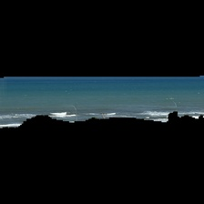

# Run guide

```bash
pip install -r requirements.txt
python step_1_b_preprocess_water_inputs.py
python step_2_a_reduce_black_water_area.py
python step_2_b_label_data.py        # labeling UI at http://localhost:8055, saves labels.csv
python step_3_a_prepare_dataset_split.py
python train.py                       # or: python step_5_b_train.py
python step_6_a_evaluate_test.py
```

Predict one or more new photos:

```bash
# put HEIC/JPG/PNG in predict-holder/, then:
python step_7_a_predict.py
# previews -> step-7-inference-preview/
# prediction histories -> predict-holder/predictions/
```

Notes: steps skip existing outputs, so reruns are safe. Use `--device cpu` on the step 1/2 scripts to force CPU.

Step 7 reuses valid cached inference previews when switching checkpoints.

---

The repository’s retraining flow is:

`new raw photos → Step 1 preprocessing → Step 2 lower-water crop → manual labels → dataset split → training → optional evaluation/inference`

Run all commands from:

```bash
cd /path/to/wave-regression-model
```

## Step 0: Add the new photos

Copy new JPEG, PNG, HEIC, HEIF, TIFF, BMP, or WebP photos into:

```text
step-0-raw-data/
```

Use unique filenames containing an image number, for example:

```text
IMG_7400.jpg
IMG_7401.jpg
IMG_7402.jpg
```

The split script requires filenames containing an `IMG_<number>` pattern.

Do not replace an existing photo with the same filename unless you also remove its generated pipeline outputs. Existing output filenames cause later steps to skip that image.

## Step 1: Prepare the water inputs

### Optional: create water-mask previews

This is for inspecting whether the pretrained segmentation model correctly detects the sea:

```bash
python step_1_a_prepare_water_masks.py
```

Open this file in a browser:

```text
water-mask-preview/index.html
```

Inspect the original, mask, and overlay images. The generated `original` and `overlay` files are previews and should not be committed.

### Create standardized Step 1 inputs



Run:

```bash
python step_1_b_preprocess_water_inputs.py
```

For CPU-only processing:

```bash
python step_1_b_preprocess_water_inputs.py --device cpu
```

This reads from:

```text
step-0-raw-data/
```

and writes standardized `224x224` images to:

```text
step-1-processed-data/
```

Open:

```text
step-1-processed-data/index.html
```

The script skips images whose `step-1_<name>.jpg` output already exists.

## Step 2: Create and label the lower-water images

### Create the lower-water Step 2 images


Run:

```bash
python step_2_a_reduce_black_water_area.py
```

For CPU-only processing:

```bash
python step_2_a_reduce_black_water_area.py --device cpu
```

This reads the Step 1 outputs and writes:

```text
step-2-final-water-data/
```

The crop selection is designed to retain the lower part of the detected water area, where waves are expected to be most visible.

Inspect the result here:

```text
step-2-final-water-data/index.html
```

The script skips images whose `step-2_<name>.jpg` output already exists.

### Label the new Step 2 images

Start the labeling web app:

```bash
python step_2_b_label_data.py
```

Open this URL:

```text
http://localhost:8055
```

In the labeling UI:

1. Select “Unlabeled first”.
2. Set the waviness value from `0.00` to `1.00`.
3. Use increments of `0.05`.
4. Click “Save & Next”.
5. Continue until all new images are labeled.
6. Stop the server with `Ctrl+C`.

Labels are saved automatically to:

```text
labels.csv
```

The existing labels are preserved. You do not need to manually edit the CSV.

## Step 3: Rebuild the dataset splits

Run:

```bash
python step_3_a_prepare_dataset_split.py
```

This validates that:

- every labeled image exists in `step-2-final-water-data/`;
- labels are between `0.0` and `1.0`;
- filenames are unique and contain an image number;
- no capture group is split across train, validation, and test.

Existing assignments remain fixed. New capture groups are assigned incrementally, so previously trained data is not randomly reshuffled.

Review:

```text
step-3-dataset-splits/summary.txt
```

The generated manifests are:

```text
step-3-dataset-splits/train.csv
step-3-dataset-splits/validation.csv
step-3-dataset-splits/test.csv
```

A timestamped immutable snapshot is also created under:

```text
step-3-dataset-splits/snapshots/
```

## Step 4: Inspect the training data

Run:

```bash
python step_4_c_inspect_training_data.py
```

Then open:

```text
step-4-data-preview/index.html
```

This checks tensor shapes, labels, deterministic validation/test transforms, and displays training augmentations.

## Step 5: Train a new model

Run:

```bash
python train.py
```

The training script:

- loads `train.csv` and `validation.csv`;
- uses the existing preprocessing outputs;
- automatically chooses the next model version;
- does not overwrite earlier checkpoints;
- saves the best checkpoint based on validation MAE;
- uses early stopping;
- writes a training summary and manifest.

New checkpoints will be created in:

```text
step-5-checkpoints/vN-mae-<best-mae>/
```

Each training version directory contains its checkpoint, manifest, summary,
training history, and plots. Existing root-level artifacts can be organized with:

```bash
python migrate_step_5_checkpoints.py --dry-run
python migrate_step_5_checkpoints.py
```

The command prints the exact best checkpoint path. Use that path for later evaluation or prediction.

## Step 6: Evaluate the test set

Run:

```bash
python step_6_a_evaluate_test.py
```

The evaluation uses the immutable `benchmark-v1` test manifest by default and automatically selects the newest training manifest's best checkpoint. To evaluate a specific checkpoint, set `EVALUATION_CHECKPOINT_PATH` to its path.

Results are written to a checkpoint- and SHA-256-specific directory under:

```text
step-6-test-evaluation/
```

Evaluations from different checkpoints are preserved in separate directories.

## Step 7: Use the new checkpoint for predictions

Configure the prediction checkpoint in `.env` (or the environment) using:

```text
# Use the exact best-checkpoint path printed by train.py.
PREDICT_CHECKPOINT_PATH=step-5-checkpoints/vN-mae-<best-mae>/<best-checkpoint>.ckpt
```

After training, update `PREDICT_CHECKPOINT_PATH` to the new checkpoint path printed by `train.py`.

Then put new inference photos in:

```text
predict-holder/
```

Run:

```bash
python step_7_a_predict.py
```

Predictions and processed previews are written to:

```text
step-7-inference-preview/
predict-holder/predictions/
```

The prediction directory contains one append-only `.txt` history per input photo. Each record includes the waviness prediction, selected checkpoint path, checkpoint SHA-256, timestamp, device, and elapsed processing time. A valid `step-7-inference-preview/<photo-stem>-model-input.jpg` is the checkpoint-independent cached model input, so changing checkpoints reuses the preview and reruns only regression inference. A photo is skipped only when both its valid preview and a record for the same checkpoint are present. Missing previews trigger Steps 1 and 2; malformed previews fail clearly rather than being silently replaced. Delete a preview to force regeneration.

## Step 8: Run the baseline experiment

```bash
python step_8_a_constant_prediction_baselines.py
```

Step 8 compares training-mean and training-median baselines with the matching neural-network checkpoint. Its append-only JSON and Markdown reports are kept in `step-8-baseline experiment/`; test data is not evaluated.

## Step 9: Review per-image errors

```bash
python step_9_a_per_image_error_analysis.py
```

Step 9 shows which validation images the model understands well and where its waviness judgments are least reliable. It helps reveal patterns in the model’s mistakes so future improvements can focus on the images that need the most attention.

## Important notes

- `step_1_a_prepare_water_masks.py` is an inspection step; `step_1_b_preprocess_water_inputs.py` is the actual Step 1 training-data preparation.
- Do not train directly from raw photos. Training uses the Step 2 outputs.
- Do not delete or reshuffle existing split manifests; the repository intentionally preserves previous assignments.
- `step_6_a_evaluate_test.py` always uses the immutable `benchmark-v1` test manifest by default and automatically selects the newest training manifest's best checkpoint. Set `EVALUATION_CHECKPOINT_PATH` to pin a historical checkpoint. Results are stored in checkpoint- and SHA-256-specific directories under `step-6-test-evaluation/`, so evaluations from different checkpoints are preserved.
